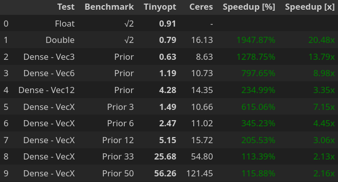
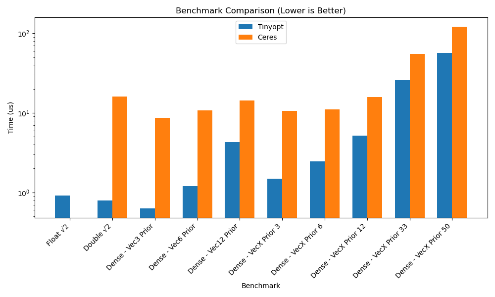

# Tinyopt

Is your optimization's convergence rate rivaling the speed of continental drift?

`Tinyopt`, the **header-only C++ hero**, swoops in to save the day! It's like a tiny,
caffeinated mathematician living in your project, ready to efficiently tackle those small-to-large optimization beasties,
including unconstrained and non-linear least squares puzzles.
Perfect for when your science or engineering project is about to implode from too much math.

Tinyopt provides **high-accuracy** and **computationally efficient** optimization capabilities, supporting both dense and sparse problem structures.
The library integrates a collection of iterative solvers including Gradient Descent, Gauss-Newton and Levenberg-Marquardt algorithms (more are coming).

Furthermore, to facilitate the computation of derivatives, `Tinyopt` seamlessly integrates the **automatic differentiation** capabilities which empowers users to effortlessly compute accurate gradients.

Tinyopt is open-source, licensed under the Apache 2.0 License. 🧾

## Why is Tinyopt so fast?

`Tinyopt` achieves efficiency through its Accumulation function, which offers a unique approach.
Instead of the conventional method of storing extensive lists of residuals and their Jacobians,
it empowers users to directly populate the linear system with gradients and Hessians.
This manual filling significantly curtails overhead and memory usage,
requiring storage only for the more compact gradient (and optionally, the Hessian).

However, these advantages are realized specifically when leveraging the Accumulation function;
they are not applicable when employing automatic or numerical differentiation techniques.

## Table of Contents
[Installation](#installation-)

[Usage](#usage-)

[Benchmarks](#benchmarks-how-fast-is-tinyopt-)

[Roadmap](#roadmap-%EF%B8%8F)

[Get Involved](#get-involved--get-in-touch-)

# Installation 📥

Simply clone the repo, configure and install.

```shell
git clone https://github.com/julien-michot/tinyopt
cd tinyopt && mkdir build && cd build
cmake .. -DTINYOPT_BUILD_TESTS=OFF
sudo make install
```

Header files will be copied to `/usr/local/include`.

# Usage 👨🏻‍💻

## Tinyopt: The Easy Way 😎

`Tinyopt` is inspired by the simple syntax of python so it is very developer friendly*, just call `Optimize` and give it something to optimize, say `x` and something to minimize.

`Optimize` performs automatic differentiation so you just have to specify the residual(s),
no jacodians/derivatives to calculate because you know the pain, right? No pain, vanished, thank you Julien.

\* but not compiler friendly, sorry gcc/clang but you'll have to work double because it's all templated.

### Example: What's the square root of 2? 🤓
Beause using `std::sqrt` is over hyped, let's try to recover it using `Tinyopt`, here is how to do:

```cpp
// Import the optimizer you want, say the default NLLS one
using namespace tinyopt::nlls;
// Define 'x', the parameter to optimize, initialized to '1' (yeah, who doesn't like 1?)
double x = 1;
Optimize(x, [](auto &x) { return x * x - 2.0; }); // Let's minimize ε = x*x - 2
// 'x' is now √2, amazing.
```
That's it. Is it too verbose? Well remove the comments then. Come on, it's just two lines, I can't do better.

Running this will give you x = √2 at the end as well as some nerdy info:

```shell
tinyopt# make run_tinyopt_test_sqrt2
💡 #0: τ:0.00ms x:{1} |δx|:5.00e-01 λ:1.00e-04 ε:1.00e+00 n:1 dε:-3.403e+38 |∇|:4.000e+00
✅ #1: τ:0.06ms x:{1.49995} |δx|:8.33e-02 λ:3.33e-05 ε:2.50e-01 n:1 dε:-7.502e-01 |∇|:5.618e-01
✅ #2: τ:0.07ms x:{1.41667} |δx|:2.45e-03 λ:1.11e-05 ε:6.94e-03 n:1 dε:-2.429e-01 |∇|:3.871e-04
✅ #3: τ:0.08ms x:{1.41422} |δx|:2.11e-06 λ:3.70e-06 ε:5.96e-06 n:1 dε:-6.938e-03 |∇|:2.842e-10
✅ #4: τ:0.08ms x:{1.41421} |δx|:4.21e-08 λ:1.23e-06 ε:1.19e-07 n:1 dε:-5.841e-06 |∇|:1.137e-13
🌞 Reached minimal gradient (success)
```

## Tinyopt: The "Just Works" Example (Minimal Edition)

Feeling lost? Fear not! We've crafted a delightful, teeny-tiny CMake project in [tinyopt-example](https://github.com/julien-michot/tinyopt-example) that'll have you parsing options faster than you can say "command-line arguments."
It's so simple, even your pet rock could probably figure it out. (Though, we haven't tested that rigorously.)

## API Documentation 📚

Have a look at our [API doc](https://github.com/julien-michot/tinyopt/blob/main/docs/API.md) or delve into
the full doc at [ReadTheDocs](https://tinyopt.readthedocs.io/en/latest).

# Benchmarks: How fast is Tinyopt? 🚀

`Tinyopt` is fast, **really fast**, one of the fastest optimization library out there!


## Setup
We're currently evaluating small dense problems (<50 dimensions) with one cost function on a
Ubuntu GNU/Linux 2024.04 64b.
We're showing without Automatic Differentiation as there's some time increase with it, but not that much.
The script `benchmarks/scripts/run.sh` was called after making sure the CPU powermodes were all in 'performance'.
Plotting is done using the notebook `benchmarks/scripts/results.ipynb`.

## Benchmarks Results 🎯

Check this out, we're comparing `Tinyopt` against the well known [Ceres solver](http://ceres-solver.org/).



It's Super Green 💚, Korben!

### Benchmarks Plot 📈



Dang, this thing's got some serious pep in its step, making other optimization libraries look like they're enjoying a leisurely Sunday drive. We put it in the ring with the well-respected Ceres solver, and the results were... eye-opening!
My beloved old Cadillac Eldorado Biarritz computer (a true classic, if a bit slow by modern standards) practically
sputtered trying to process Tinyopt's sheer velocity.

I'm still double-checking the numbers to make sure my vintage machine wasn't just having a particularly enthusiastic day.
Is it actually *that* quick? Well, Tinyopt's certainly making me wonder if my computer needs a pit stop for some performance upgrades!

Note that the current benchmarks are only for somewhat *small* problems, I expect the timings difference will reduce
as the problem size (not residuals!) increases as Ceres-Solver has nice tricks that Tinyopt hasn't...just yet!

# Roadmap 🗺️

Here is what is coming up. Don't trust too much the versions as I go with the flow.

### v1 (Stable API)

- [ ] Add l-BFGS for large sparse problems
- [ ] Update all docs
- [ ] Refactor Num/Auto differentiation using AutoDiff lib (support: sparse, unconstrained optimization)

### v1.x (Bindings)
- [ ] Add C API
- [ ] Add python binding
- [ ] Add Rust binding
Also,
- [ ] A wider array of benchmarks

### v2 (Armadillo & Many Solvers)
- [ ] Native support of Armadillo (as alternative to Eigen)
- [ ] Refactor Solvers
- [ ] Add more backends (e.g. nvcc, SuiteSparse, etc.)
- [ ] Add more optimizers (CG, Adam, ...)
- [ ] Speed-up large problems (AD to support very large sparse systems, move to autodiff?)
- [ ] Speed-up compilation (e.g. c++20 Concepts)

Ah ah, you thought I would use Jira for this list? No way.

# Get Involved & Get in Touch! 🤝

## Citation 📑

If you find yourself wanting to give us a scholarly nod, feel free to use this BibTeX snippet:

```bibtex
@misc{michot2025,
    author = {Julien Michot},
    title = {tinyopt: A tiny optimization library},
    howpublished = "\url{https://github.com/julien-michot/tinyopt}",
    year = {2025}
}
```

## Fancy Lending a Hand? (We'd Love That!) 🤩
Feel free to contribute to the project, there's plenty of things to add,
from bindings to various languages to adding more solvers, examples and code optimizations
in order to make `Tinyopt`, truly the fastest optimization library!

Otherwise, have fun using `Tinyopt` ;)

## Got Big Ideas (or Just Want to Chat Business)?

If your business needs a super fast 🔥 **Bundle Adjustment** (BA), a multi-sensor **SLAM** or
if `Tinyopt` is still taking its sweet time with your application and
you're finding yourself drumming your fingers impatiently, don't despair!

Feel free to give [me](https://github.com/julien-michot) a shout, I can probably help!

