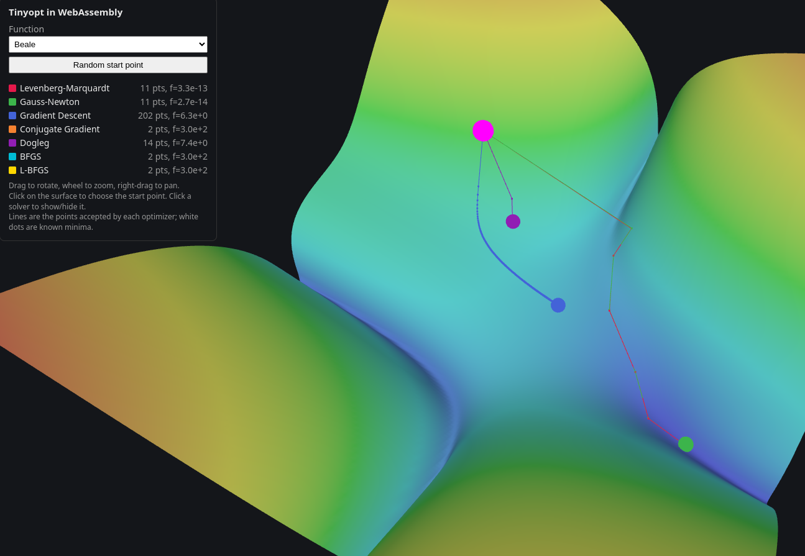

# Tinyopt WebAssembly / JavaScript Example

Tinyopt's [C API](../../docs/api/c.md) compiled to WebAssembly with Emscripten and driven directly
from JavaScript, no glue code: `optimizer.js` writes the C structs into the module memory and
passes JavaScript functions as the C callbacks.

```sh
pixi run build-wasm      # build-wasm/wasm-example: tinyopt.mjs + tinyopt.wasm + the page
pixi run test-wasm       # headless check of the module with Node
pixi run wasm-example    # serve it, then open http://localhost:8000
```

`build-wasm` cross-compiles the C library into its own `build-wasm/` directory (the native
`build-c-library/` cannot be linked into WebAssembly); it only builds double precision and the
2D fixed size, so it is fast. It needs Emscripten, provided by the `wasm` pixi environment, and
`-DTINYOPT_BUILD_WASM=ON` when using CMake directly. The page loads three.js from a CDN.

The JS layer exposes a small wrapper object that hides the raw wasm memory writes behind a plain
`options` object and a `minimize(problem, start, options)` entry point; the example still calls the
low-level C ABI underneath, but app code does not need to fight the `HEAP32`/`HEAPF64` layout.



## `index.html` / `main.js`: optimizer trajectories on 3D cost surfaces

The demo starts with a few beginner-friendly problems (quadratic, linear system, offset plane)
and then moves into the classical 2D least-squares cases (Rosenbrock, Himmelblau, Beale, Booth,
Freudenstein-Roth). They are solved by Levenberg-Marquardt, Gauss-Newton, Gradient Descent,
Conjugate Gradient, Dogleg, BFGS and L-BFGS. The cost is drawn in 3D (log-scaled height).

- Pick the function in the menu, rotate/zoom/pan with the mouse.
- A random start point is used; "Random start point" draws another one.
- Click on the surface to choose the start point.
- Each optimizer has its own color and its trajectory is drawn; click a legend entry to hide it.
  White dots are the known minima.

Trajectories come from `options.step_callback` (see the
[C API guide](../../docs/api/c.md)), which reports every step added to the parameters and every
roll-back of a rejected step.

## Files

| File | Role |
| --- | --- |
| `problems.js` | The five problems: residuals, Jacobians, domains, known minima. |
| `optimizer.js` | `createOptimizer()`: wasm32 struct layout, callbacks, `minimize()` returning the trajectory. |
| `main.js`, `index.html` | three.js scene and UI. |
| `test.mjs` | Node test: Jacobian check, every solver on every problem, layout check against the C defaults. |

Residual based solvers (LM, Gauss-Newton, Dogleg) use `TINYOPT_EVAL_RESIDUALS`; the others
(gradient descent, conjugate gradient, BFGS, L-BFGS) use `TINYOPT_EVAL_GRADIENT` with
cost `0.5 * |r|^2` and gradient `J^T r`. Undamped Gauss-Newton often rejects its first step on these
non-linear problems, which is visible as a trajectory reduced to the start point.
